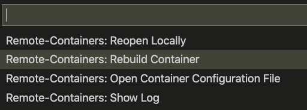

# SAP CAP VS Code dev container

Uuuuh, a long name with a lot of buzz words and acronyms.  

This project contains a docker development configuration for Microsofts Visual Studio Code and it configures everything you need to develop your SAP CAP applications.

But lets describe why it is interesting and what we really need it for.

## What is a docker dev container for VS Code?

Our beloved IDE VS Code is able to connect to remote computers via ssh. That means you can run your VS Code locally at whatever OS you feel comfortable and your development environment runs on a completely different computer, aka server.   

And in these days this server can of course also be a docker container that runs on your computer.

## Why should I use a docker dev container?

So you say I should run VS Code on my computer, start a docker container and connect VS Code to this container? Why should I do that?

There are at least two good reasons for this.

### No side-effects

Docker opens a container and runs an own OS in it. This container is totally isolated from the OS it is running on. They can only communicate with each other via ports that are exposed by the container. That way a docker container behaves like a server that stands far away at the other side of the world.

When you run your development environment on a separate container (server) this environment has only access to the tools that are installed in this container. That means you don't have any side effects that are caused by tools you have installed on your personal PC.

### Same dev env in a team

The second and in my opinion more important reason is that with a dev container you can ensure that everyone in your development team runs the same dev environment. Even better, if a new colleague enters your team (s)he just have to install VS Code, the [Remote Development](https://marketplace.visualstudio.com/items?itemName=ms-vscode-remote.vscode-remote-extensionpack) extension and open the folder or workspace in VS Code.

After this (s)he can start working with the same dev environment as everyone in the team. Not only OS tools are the same but also the VS Code extensions. 

I often think back to my early Eclipse development days. I spent hours and days to find errors that were caused by different dev environments at the PCs of the team members.

## But what when I accidentally delete the Docker container?

You fear that you loose all your work if you accidentally delete your container? This is not the case cause you mount a local folder into the container. So after that happened you simply rebuild your container and work as before.

Cause your local folder is only mounted everything you do inside the container is immediately visible in your local folder and vice versa.

## So, what do I have to do?

Sounds really difficult what you tell here. I want to develop and not spend hours setting up my dev environment.

Exactly here the VS Code remote dev environments come into game. **You just have to follow these steps and you are good to go.**

-  Install the [Remote Development](https://marketplace.visualstudio.com/items?itemName=ms-vscode-remote.vscode-remote-extensionpack) extension into your local VS Code installation.
- Copy the folder `.devcontainer` into your project or workspace folder.
- Open your folder in VS Code. If VS Code finds a `.devcontainer` folder with a `devcontainer.json` file in it asks you if you want to reopen your project in a remote docker container.
- You just confirm to open in a container, that's it.
- VS code now creates a Docker container and connects to it.

When you now open an internal Terminal view in VS Code you are connected to your working folder inside the container. You can develop, build, run, debug, ... your program here. 
Every operation you make in VS Code happens in your container.

### But how to connect to container services?

Sounds good, but what if I e.g. start a web server inside my container. How can I access this from my local browser?

Oh, that's also no problem. You can simply expose ports from your container to the outside world. In the given `devcontainer.json` the port 4004 is already exposed cause cds runs the server at this port.

So in your local browser you just invoke the url `http://localhost:4004` and you're fine.

## And how do my colleagues benefit from this?

Wow! I can develop in a controlled and isolated environment now. This give me much more confidence in my development results. But do my colleagues have to do the same on their PC or is there a simpler way for them?

Yes, there is. You simply check the `.devcontainer` folder into your version control system, aka GIT. Your team members clone your GIT repository and open the folder in VS Code. Then they are also asked if they want to open the folder in a remote docker container.

If they confirm VS Code creates a Docker container on their PC and connects to this. The great thing is that inside the container your colleagues have the same tools and VS Code extensions installed as you have.

The only thing they have to do beforehand is installing the [Remote Development](https://marketplace.visualstudio.com/items?itemName=ms-vscode-remote.vscode-remote-extensionpack) extension, like you did. 

## Ok, but what do we get with your dev container?

Let's come to the CDS part. My dev container contains 

- Linux **Debian GNU/Linux 9 OS**
- **Node.js V12**
- **sqlite3**
- **SAP CDS** cli
- **Typescript** (you don't have to use it but can if you like it like I do)
- **eslint**
- The **npm SAP registry** is already set with `npm set @sap:registry=https://npm.sap.com -g`

Additionally you get the following VS Code extensions preinstalled

- **[eslint](https://marketplace.visualstudio.com/items?itemName=dbaeumer.vscode-eslint)**
- The brand new **[JavaScript Debugger](https://marketplace.visualstudio.com/items?itemName=ms-vscode.js-debug-nightly)**
- **[Prettier Code formatter](https://marketplace.visualstudio.com/items?itemName=esbenp.prettier-vscode)**
- **[Todo Tree](https://marketplace.visualstudio.com/items?itemName=Gruntfuggly.todo-tree)** for managing your TODOs.
- The **[CDS Language Support](https://tools.hana.ondemand.com/additional/vscode-cds-updateSite/vscode-cds-1.4.0.vsix)** extension we can find at tools.hana.ondemand.com

For the latter you implicitely aggree to this [LICENSE](https://tools.hana.ondemand.com//developer-license-3_1.txt).

## What if I need additional tools / extensions?

Ok, that's already a nice collection of tools and extensions. But me and my team need more and don't want all of those you preselected for us.

Nothing easier than this. Just edit the `Dockerfile`  or `devcontainer.json` file in the `.devcontainer` folder, save it and invoke the `Remote-Container: Rebuild container` from VS Code command palette.

## More information

You got me, it's really amazing what's possible with this containers. Can I do more?
Here you find more information about [Developing inside a Container](https://code.visualstudio.com/docs/remote/containers).

  

​    